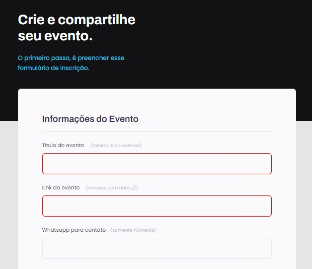

<h1 align="center">
  LISTA DE EVENTOS
</h1>

  

  <a href="#-tecnologias">Tecnologias</a>&nbsp;&nbsp;&nbsp;|&nbsp;&nbsp;&nbsp;
  <a href="#-projeto">Projeto</a>&nbsp;&nbsp;&nbsp;|&nbsp;&nbsp;&nbsp;
  <a href="#memo-licença">Licença</a>

 
  
  

  

  

 

  

## 🚀 Tecnologias

Esse projeto foi desenvolvido com as seguintes tecnologias:

- HTML
- CSS
- FIGMA

## ☁ Deploy:

LINK: https://oborrges.github.io/form-event/

## 🚧 Projeto:

Em cunstrução, sera adicionada responsividade

## 🎨 Inspiração:

Figma: https://www.figma.com/file/lFYufJZ2PXXxvQ8iMLwnR5/Explorer-Stage-03-Projeto-01-(Copy)?node-id=0%3A1&t=tCpJyzGy11qLdksc-0

## :memo: Licença

Esse projeto está sob a licença MIT. Veja o arquivo [LICENSE](LICENSE) para mais detalhes.

---

Feito com ♥ by @oborrges
